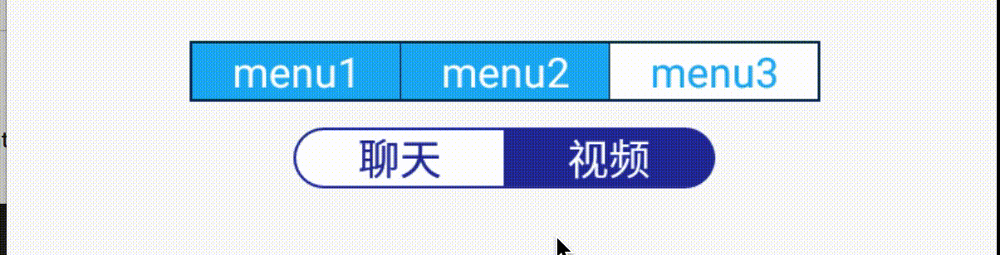
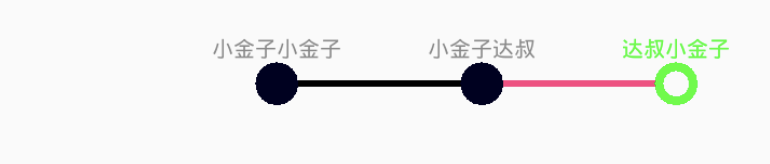
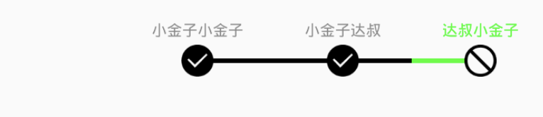
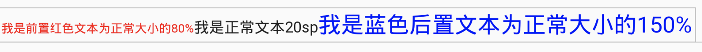
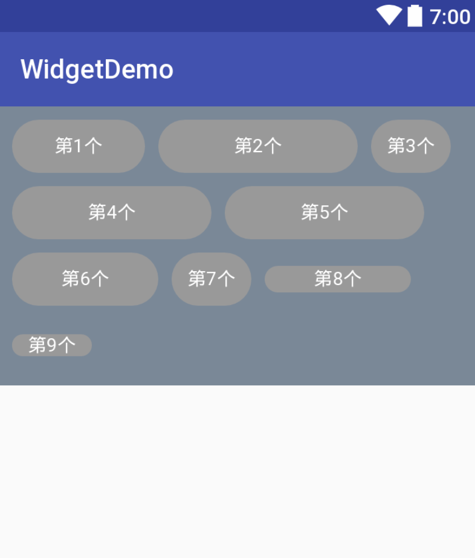

# widget
common widget for Android


## how to use

edit your main build.gradle file

```
allprojects {
    repositories {
        jcenter()
        maven { url 'https://jitpack.io' }
    }
}
```

add dependencies to your module build.gralde

```
compile 'com.github.xiaojinzi123:widget:v1.1.7.6'
```

## I will introduce all usage of weiget

### TabHost
#### use

```
<com.move.widget.XTabHost
		app:data="@array/test1"
		app:tab_space="1px"
		app:bg="#123456"
		android:padding="1dp"
		app:default_index="1"
		android:layout_width="wrap_content"
		android:layout_height="wrap_content"/>

<com.move.widget.XTabHost
		app:data="@array/test2"
		app:bg="@color/colorPrimaryDark"
		android:layout_marginTop="10dp"
		android:padding="1dp"
		app:tab_select_color="@color/white"
		app:tab_unselect_color="@color/colorPrimaryDark"
		app:text_unselect_color="@color/white"
		app:radius="50dp"
		app:text_size="8sp"
		app:text_select_color="@color/colorPrimaryDark"
		android:layout_width="wrap_content"
		android:layout_height="wrap_content"/>

```

#### result


### StepView1
#### use

```
<com.move.widget.StepView1
                android:id="@+id/sv1"
                android:layout_width="wrap_content"
                android:layout_height="wrap_content"
                android:layout_gravity="right"
                android:padding="20dp"
                android:paddingBottom="12dp"
                android:paddingLeft="0dp"
                android:paddingRight="0dp"
                android:paddingTop="10dp"
                app:sv1_data="@array/test"
                app:sv1_horizontal_space="40dp"
                app:sv1_line_height="3dp"
                app:sv1_line_margin="0dp"
                app:sv1_circle_selected_color="#000022"
                app:sv1_circle_radius="8dp"
                app:sv1_circle_border_width="4dp"
                app:sv1_line_color="@color/colorAccent"
                app:sv1_line_selected_color="#000000"
                app:sv1_progress="1"
                app:sv1_text_size="10" />
```

#### result


### StepView2
#### use

```
<com.move.widget.StepView2
                android:id="@+id/sv2"
                android:layout_width="wrap_content"
                android:layout_height="wrap_content"
                android:layout_gravity="right"
                android:padding="20dp"
                android:paddingBottom="12dp"
                android:paddingLeft="0dp"
                android:paddingRight="0dp"
                android:paddingTop="10dp"
                app:sv2_data="@array/test"
                app:sv2_horizontal_space="40dp"
                app:sv2_line_height="3dp"
                app:sv2_line_margin="-2dp"
                app:sv2_line_color="@color/colorAccent"
                app:sv2_line_selected_color="#000000"
                app:sv2_progress="1"
                app:sv2_state_drawable="@mipmap/no"
                app:sv2_state_selected_drawable="@mipmap/ok"
                app:sv2_state_size="24dp"
                app:sv2_text_size="10" />
```

#### result


### RelativeSizeTextView
#### use

```
<com.move.widget.RelativeSizeTextView
            android:id="@+id/tv"
            android:layout_width="wrap_content"
            android:layout_height="wrap_content"
            android:padding="5dp"
            android:text="我是正常文本20sp"
            android:textSize="20sp"
            app:endText="我是蓝色后置文本为正常大小的150%"
            app:end_proportion="1.5"
            app:end_text_color="#0000FF"
            app:start_proportion="0.8"
            app:startText="我是前置红色文本为正常大小的80%"
            app:start_text_color="#FF0000" />
```

#### result


### XFlowLayout
#### use

```
<com.move.widget.XFlowLayout
        android:layout_width="match_parent"
        android:layout_height="wrap_content"
        android:layout_marginBottom="100dp"
        android:background="#789"
        android:padding="10dp">

        <TextView
            android:layout_width="100dp"
            android:layout_height="40dp"
            android:background="@drawable/demo_bg1"
            android:gravity="center"
            android:text="第1个"
            android:textColor="#FFFFFF" />

        <TextView
            android:layout_width="150dp"
            android:layout_height="40dp"
            android:background="@drawable/demo_bg1"
            android:gravity="center"
            android:text="第2个"
            android:textColor="#FFFFFF" />

        <TextView
            android:layout_width="60dp"
            android:layout_height="40dp"
            android:background="@drawable/demo_bg1"
            android:gravity="center"
            android:text="第3个"
            android:textColor="#FFFFFF" />

        <TextView
            android:layout_width="150dp"
            android:layout_height="40dp"
            android:background="@drawable/demo_bg1"
            android:gravity="center"
            android:text="第4个"
            android:textColor="#FFFFFF" />

        <TextView
            android:layout_width="150dp"
            android:layout_height="40dp"
            android:background="@drawable/demo_bg1"
            android:gravity="center"
            android:text="第5个"
            android:textColor="#FFFFFF" />

        <TextView
            android:layout_width="110dp"
            android:layout_height="40dp"
            android:background="@drawable/demo_bg1"
            android:gravity="center"
            android:text="第6个"
            android:textColor="#FFFFFF" />

        <TextView
            android:layout_width="60dp"
            android:layout_height="40dp"
            android:background="@drawable/demo_bg1"
            android:gravity="center"
            android:text="第7个"
            android:textColor="#FFFFFF" />

        <TextView
            android:layout_width="110dp"
            android:layout_height="20dp"
            android:background="@drawable/demo_bg1"
            android:gravity="center"
            android:text="第8个"
            android:textColor="#FFFFFF" />

        <TextView
            android:layout_width="60dp"
            android:layout_height="wrap_content"
            android:background="@drawable/demo_bg1"
            android:gravity="center"
            android:text="第9个"
            android:textColor="#FFFFFF" />

    </com.move.widget.XFlowLayout>
```

#### result

